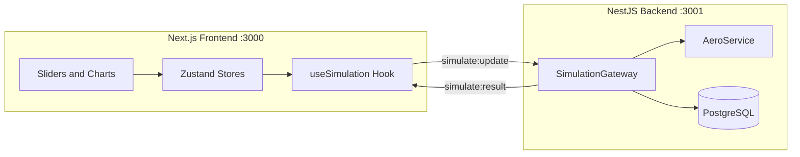

# F1 AeroLab

**Formula 1 aerodynamics simulator and learning platform.** Tune car parameters in real time and watch downforce, drag, grip, and efficiency update live via WebSocket.

[](https://nextjs.org/)
[](https://react.dev/)
[](https://www.typescriptlang.org/)
[](https://tailwindcss.com/)

---

## About

F1 AeroLab is an interactive engineering playground for Formula 1 aerodynamics. Adjust speed, wing angle, weight, and drag coefficient with sliders, then see aerodynamic forces recalculate instantly through a live Socket.io connection to a NestJS backend.

The project is **educational first**: it teaches F1 aero physics through simulation, documentation, and architecture transparency. It also serves as a full-stack portfolio piece demonstrating Next.js, WebSockets, Zustand, and real-time data visualization.

**Companion backend:** [f1-aerolab-backend](https://github.com/NikaEbraLidze/f1-aerolab-backend) (NestJS + PostgreSQL + Prisma)

---

## Features

| Feature | Description |
|---------|-------------|
| **Live simulation** | Real-time parameter updates over WebSocket with debounced `simulate:update` events |
| **Aero metrics** | Downforce, drag, lift, aero efficiency, grip, and weight transfer |
| **Performance charts** | Recharts speed-force curves (0–400 km/h, 41 data points) |
| **Car presets** | Save, load, and delete setups via REST API |
| **Learn page** | Plain-language docs on formulas, constants, inputs, and outputs |
| **Build page** | Full-stack architecture, tech stack, API contract, and module map |
| **i18n** | English and Georgian UI via lightweight locale files |
| **Theming** | Dark and light mode with persisted preference |
| **SEO** | Per-route metadata, Open Graph, Twitter cards, sitemap, and robots.txt |

---

## Pages

| Route | Purpose |
|-------|---------|
| `/` | Landing page with feature overview and navigation |
| `/simulation` | Live simulator: sliders, stat cards, chart, preset management |
| `/learn` | Aerodynamic formulas, physics constants, parameter and output reference |
| `/build` | Project architecture, repositories, WebSocket/REST contracts, roadmap |

---

## Tech Stack

| Layer | Technology |
|-------|------------|
| Framework | Next.js 16 (App Router) |
| UI | React 19, TypeScript 5 (strict) |
| Styling | Tailwind CSS 4 (`@theme` design tokens) |
| State | Zustand 5 |
| Real-time | Socket.io-client |
| Charts | Recharts |
| Icons | Google Material Symbols (no icon library) |

---

## Architecture



**Data flow:** User moves a slider → Zustand updates params → `useSimulation` debounces and emits `simulate:update` → backend runs aero formulas → `simulate:result` returns forces and chart data → UI re-renders.

---

## Getting Started

### Prerequisites

- **Node.js** 20+
- **npm**
- **f1-aerolab-backend** running on port `3001` with PostgreSQL configured

### 1. Clone and install

```bash
git clone https://github.com/NikaEbraLidze/f1-aerolab-frontend.git
cd f1-aerolab-frontend
npm install
```

### 2. Environment variables

Create `.env.local` in the project root:

```env
NEXT_PUBLIC_API_URL=http://localhost:3001
NEXT_PUBLIC_WS_URL=http://localhost:3001
NEXT_PUBLIC_SITE_URL=http://localhost:3000
```

| Variable | Default | Description |
|----------|---------|-------------|
| `NEXT_PUBLIC_API_URL` | `http://localhost:3001` | Backend REST base URL |
| `NEXT_PUBLIC_WS_URL` | `http://localhost:3001` | Backend WebSocket URL |
| `NEXT_PUBLIC_SITE_URL` | `http://localhost:3000` | Public site URL for SEO canonical links |

### 3. Start the backend

In the backend repository:

```bash
npm run start:dev
```

Verify: `GET http://localhost:3001/health`

### 4. Run the frontend

```bash
npm run dev
```

Open [http://localhost:3000](http://localhost:3000) and go to **Simulation**.

### Production build

```bash
npm run build
npm run start
```

---

## WebSocket Contract

| Direction | Event | Payload |
|-----------|-------|---------|
| Client → Server | `simulate:update` | `{ speed, wingAngle, weight, dragCoefficient }` |
| Server → Client | `simulate:result` | `{ downforce, drag, lift, aeroEfficiency, grip, weightTransfer, chartData }` |
| Server → Client | `simulate:error` | `{ code, message, details }` |

`chartData` is an array of 41 points `{ speed, downforce, drag }` from 0 to 400 km/h in steps of 10.

---

## REST Endpoints (via backend)

| Method | Path | Description |
|--------|------|-------------|
| `GET` | `/health` | Health check |
| `POST` | `/simulation/run` | One-shot calculation |
| `GET` | `/presets` | List saved presets |
| `POST` | `/presets` | Save a preset |
| `GET` | `/presets/:id` | Get preset by ID |
| `DELETE` | `/presets/:id` | Delete preset |

---

## Project Structure

```
src/
├── app/                  # Next.js App Router routes
│   ├── page.tsx          # Home (landing)
│   ├── simulation/       # Live simulator
│   ├── learn/            # Aero documentation
│   ├── build/            # Architecture docs
│   ├── robots.ts         # Crawler rules
│   └── sitemap.ts        # Sitemap generation
├── components/
│   ├── ui/               # Primitives (Button, Slider, Typography)
│   ├── shared/           # Header, Footer, navigation
│   ├── forms/            # ParameterForm, PresetSaveForm
│   ├── cards/            # StatCard, PresetCard, FormulaCard
│   └── charts/           # AeroChart (Recharts)
├── hooks/                # useSimulation, usePresets, useLocale, useTheme
├── store/                # Zustand: simulation, presets, locale, theme
├── lib/
│   ├── api/              # REST fetch helpers
│   ├── socket/           # Socket.io client instance
│   ├── seo/              # Metadata helper and site config
│   ├── locales/          # en.ts, ka.ts UI strings
│   └── constants/        # Slider limits, physics constants
├── providers/            # StoreProvider, ThemeProvider
└── types/                # SimParams, SimResult, Preset
```

---

## Scripts

| Command | Description |
|---------|-------------|
| `npm run dev` | Start development server (port 3000) |
| `npm run build` | Production build |
| `npm run start` | Serve production build |

---

## Roadmap

| Phase | Status | Scope |
|-------|--------|-------|
| **Phase 1** | Current | Core simulation, presets, learn/build pages, i18n scaffold |
| **Phase 2** | Planned | AI explanation panel (OpenAI via backend) |
| **Phase 3** | Planned | User accounts, 3D visualization groundwork |

---

## Related Repositories

| Repository | Stack | Role |
|------------|-------|------|
| [f1-aerolab-frontend](https://github.com/NikaEbraLidze/f1-aerolab-frontend) | Next.js | This repo: UI, charts, WebSocket client |
| [f1-aerolab-backend](https://github.com/NikaEbraLidze/f1-aerolab-backend) | NestJS | API, WebSocket gateway, aero calculations, presets |

---

## License

Private project. All rights reserved.
